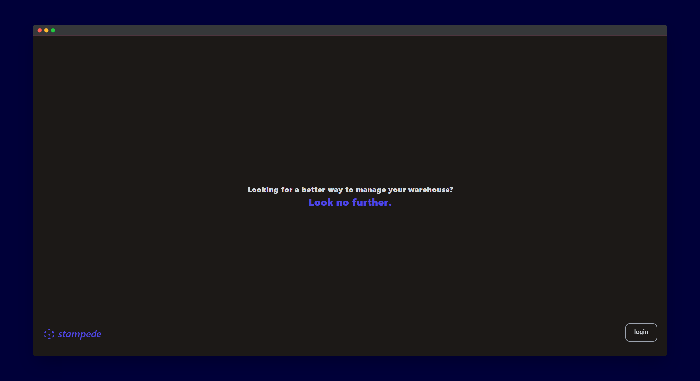
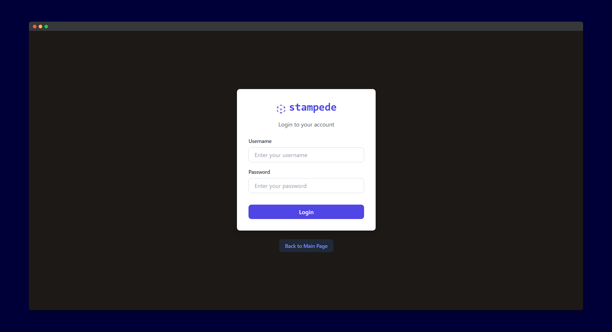
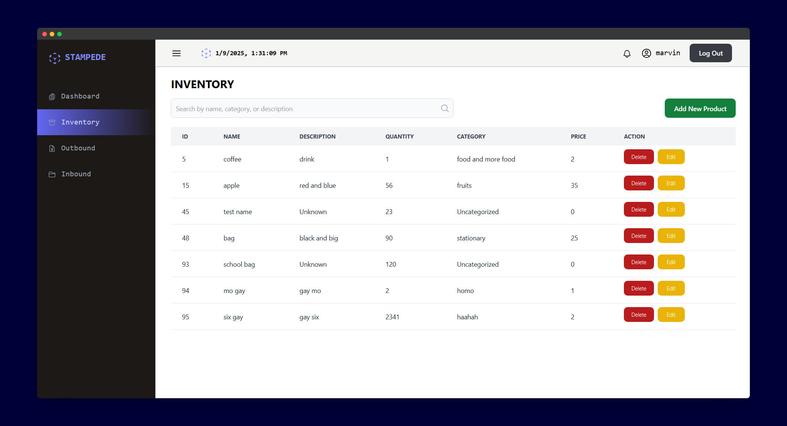

# Warehouse Inventory Management System
A full-stack application for managing warehouse operations, including inventory tracking, inbound and outbound workflows, and user role management.





## Features
1. Inventory Management:
    - View, add, update, and delete products in the inventory.
    - Search inventory by product name, category, or description.
2. Inbound Workflow:
    - Record new stock arrivals with supplier details.
    - Automatically update inventory quantities.
3. Outbound Workflow:
    - Process customer orders and shipments.
    - Check inventory stock before processing orders.
4. User Management:
    - Admins can add, update, and delete user accounts.
    - Assign roles to users: admin, manager, or operator.
    - Role-based access control for application features.
5. Dashboard
    - For now, it uses dummy data.


## Built with:
- `Frontend` &#8594; **React.js, TailwindCSS**
- `Backend` &#8594; **Node.js, expressjs**
- `Database` &#8594; **MySQL**

## Prerequisites
- **Node.js** and npm installed.
- **MySQL** installed and running locally.

## Installation & Setup
1. Clone repository:
    ```bash
    git clone https://github.com/marvinraj/warehouse-inventory-management.git
    ```
2. Install Dependencies:
    - Server side (in server folder)
        ```bash
        npm install
        ```
    - Client side (in client folder)
        ```bash
        npm install
        ```
3. Set up database <br />
    - Open db.js file in server/config/ and update the MYSQL connection below:
        ```bash
        const db = mysql.createConnection({
            host: "localhost",
            user: "your_mysql_user",
            password: "your_mysql_password",
        });
        ```
4. Start backend server (in server folder)
    ```bash
    npm run dev
    ```
5. Start client app (in client folder)
    ```bash
    npm run dev
    ```
6. Access application:
    - http://localhost:5174/

## Usage
1. Default admin credentials
    - Username: `admin`
    - Password: `admin123`
2. Roles & Access
    - Admin: Full access to all features, including user management.
    - Manager: Access to inventory, inbound, and outbound workflows.
    - Operator: Limited to viewing inventory and creating inbounds/outbounds.